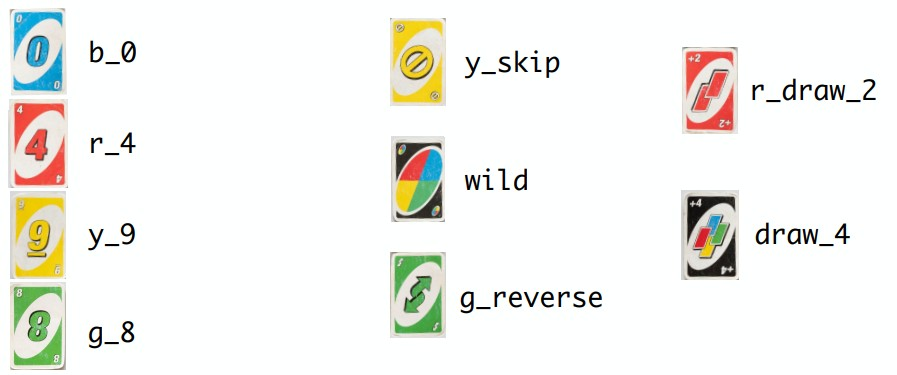
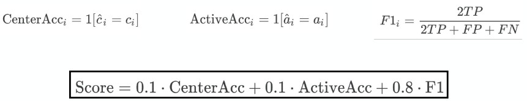

# Image Analysis and Pattern Recognition (EE-451) 2026 Final Project
This is a Github repository for a project in Image Processing and Pattern Recognition during the spring semester 2026 at EPFL.

## Project description
The goal of this project is to extract/predict structured information about a game of UNO based on images.

For every image, the pipeline predicts:
- The center card on the table
- The active player (whose turn it is, as indicated by the active player marker)
- The set of cards held by each of the four players

### Input data

The images have two types of background (white vs noisy) and two types of card layouts (non-overlapping vs overlapping).

### Model output

The results model predictions are stored in a csv following the convention shown : 

<table border="1" class="dataframe">
  <thead>
    <tr style="text-align: right;">
      <th></th>
      <th>image_id</th>
      <th>center_card</th>
      <th>active_player</th>
      <th>player_1_cards</th>
      <th>player_2_cards</th>
      <th>player_3_cards</th>
      <th>player_4_cards</th>
    </tr>
  </thead>
  <tbody>
    <tr>
      <th>0</th>
      <td>L1000770</td>
      <td>y_1</td>
      <td>p3</td>
      <td>EMPTY</td>
      <td>y_4;g_2;r_3</td>
      <td>r_skip;y_2;b_5</td>
      <td>EMPTY</td>
    </tr>
    <tr>
      <th>1</th>
      <td>L1000771</td>
      <td>r_5</td>
      <td>p1</td>
      <td>y_7;y_8;g_4</td>
      <td>EMPTY</td>
      <td>r_9;y_0</td>
      <td>EMPTY</td>
    </tr>
    <tr>
      <th>2</th>
      <td>L1000772</td>
      <td>r_9</td>
      <td>p2</td>
      <td>y_8;b_6;g_3</td>
      <td>b_skip;r_0;r_3</td>
      <td>r_6;g_2;r_9</td>
      <td>b_draw_2;y_7</td>
    </tr>
    <tr>
      <th>3</th>
      <td>L1000773</td>
      <td>y_8</td>
      <td>p4</td>
      <td>r_1;wild;g_2</td>
      <td>EMPTY</td>
      <td>draw_4;g_reverse;y_1</td>
      <td>y_reverse;r_3</td>
    </tr>
    <tr>
      <th>4</th>
      <td>L1000774</td>
      <td>r_4</td>
      <td>p3</td>
      <td>g_4;g_8;r_7;b_3</td>
      <td>r_9;g_3</td>
      <td>wild;y_3;r_8</td>
      <td>b_7;b_6</td>
    </tr>
  </tbody>
</table>

### Scoring and evaluation

The results obtained from the test dataset are then submitted to [Kaggle](https://www.kaggle.com/competitions/iapr-26-uno-vision-challenge/overview) for scoring.

For each image i, the model is evaluated based on:
- Center card prediction (10%)
- Active player prediction (10%)
- Card predictions  per player (80%)

## Repository structure

The is structured along the guidelines for the final submission with:
- A *Jupyter Notebook Report*, which documents the project and focuses on: 
    - Clear justification of design choices, explaining how each component in your method contributes to performance
    - Detailed technical descriptions of your solution
    - Strong quantitative and qualitative analyses, demonstrating and explaining the ability of your solution
- A *main.py* script, which:
    - Produce the exact submission file uploaded to Kaggle
    - Use only Python packages covered in Labs 1–3.
- A *src/ Folder*, which contains 
    - All additional code and files used by main.py
    - Model checkpoints in case deep learning is used